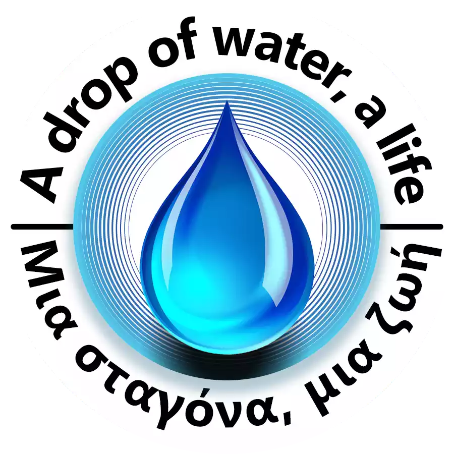
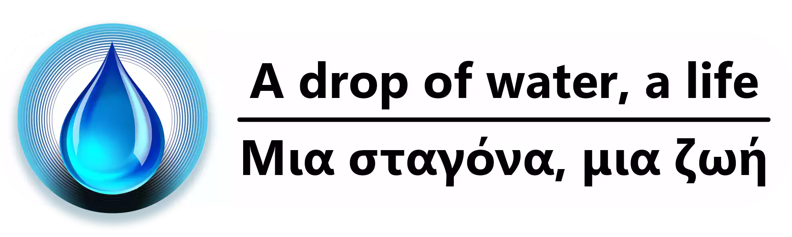

     

# A Drop of Water, a Life

[View the website](https://a-drop-of-water-a-life.web.app/)

## Welcome!

This is the source code of the official webpage for the project **"A Drop of Water, a Life"** by the Meteorology - Astronomy Club of the 1st Experimental Junior High School of Larissa, created as part of the **Climate Detectives** program.

The project focuses on analyzing the consequences of the **Daniel** storm that impacted Thessaly, while gathering broader information about this devastating event. We are proud to announce that our project won the **3rd prize nationally**!

Check out our work on the [ESA Gallery](https://climatedetectives.esa.int/projects-gallery-2023-2024/entry/62524/).

---

### Technologies Used

This website was fully developed using the following technologies:
- **React** for building the interactive user interface.
- **Framer Motion** for animations and visual effects.
- **ChartJS** for data visualization and interactive charts.

The programming aspect of this project was entirely developed by @E-Kou.

---

🎉 Thank you for visiting our project! 🎉

     

